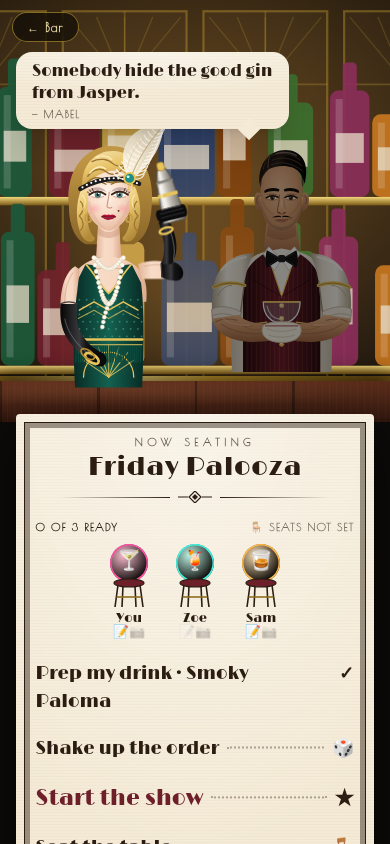
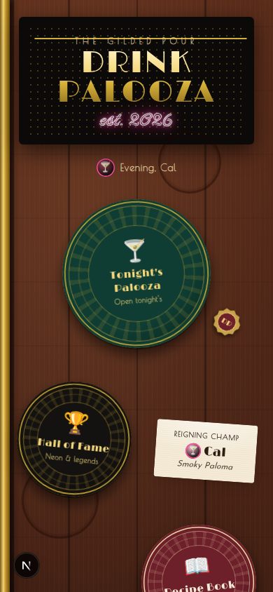
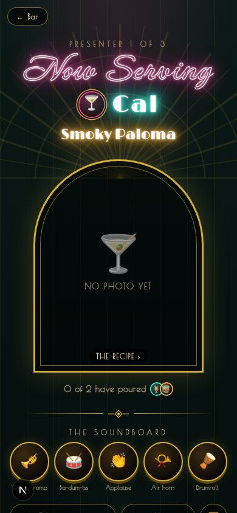
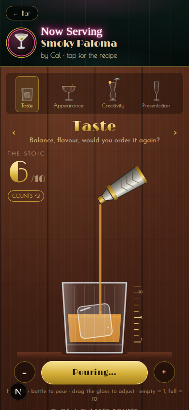
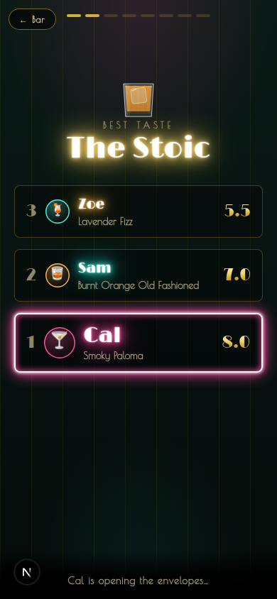
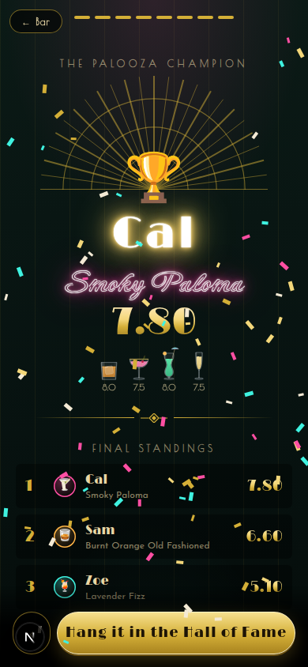
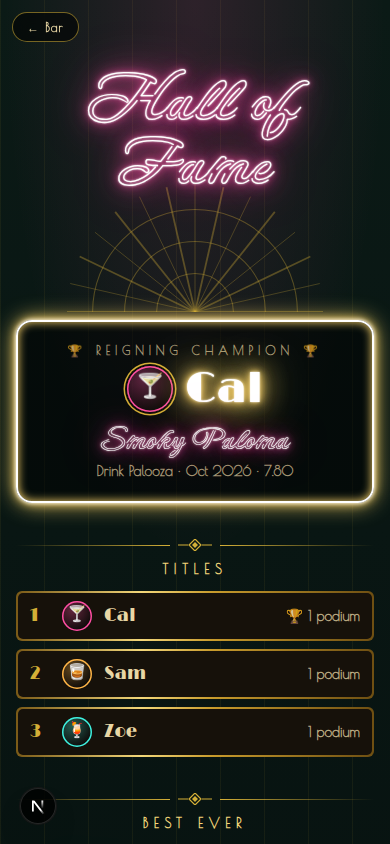
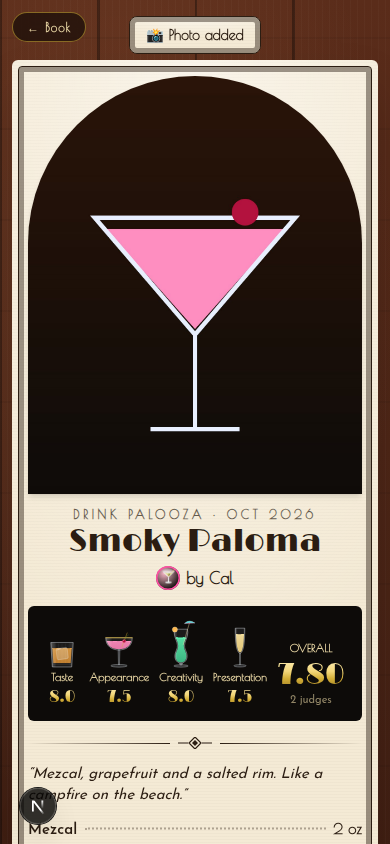

# 🍸 Drink Palooza

A private, phone-first party app for a group of friends who each make a
cocktail, present it, and get scored. It's set in an Art Deco Prohibition
speakeasy: you move through the bar with the camera instead of tapping
through pages, you score by **pouring** from a mixer bottle into a glass, and
the night ends with a Spotify-Wrapped-style reveal on a neon wall.

| Bartenders | Bar top | Presenting | Pouring | Reveal | Champion | Hall of Fame | Recipe |
|---|---|---|---|---|---|---|---|
|  |  |  |  |  |  |  |  |

Product decisions and the theme spec live in [`PLAN.md`](PLAN.md).

## How a palooza runs

```
LOBBY ──shake up the order──▶ LIVE: presenter 1 → … → N ──▶ LAST CALL ──▶ THE REVEAL ──▶ HALL OF FAME
 join, write your recipe        presenter: neon stage + soundboard   re-check pours   host advances,     records across
 (the bartenders)               everyone else: pour four glasses                       every phone follows every palooza
```

- **Sign-in.** Tap your name, or "I'm new here". There's no password; the phone remembers you, and you can switch in Settings.
- **Order.** Random. The server shuffles once, and every phone plays the same slot-machine reveal. Re-roll until the show starts; late joiners go to the back.
- **Categories.** Taste (**counts ×2**), Appearance, Creativity, Presentation. Each has its own glass: *The Stoic*, *The Showpiece*, *The Wild Card*, and *The Showstopper*, which lights a sparkler at 10.
- **Scoring.** Hold the bottle to pour, then swipe up or down on the glass to fine-tune. Empty = 1, full = 10, whole numbers only. Nothing moves on by itself: tap **Next glass** when you're happy. Pours stay hidden from everyone else and editable until the reveal.
- **During a presentation.** Emoji reactions float up on every phone. Comments go on napkins, notes are private, and anyone can add photos.
- **Seating & passed napkins.** Seat the table once (tap two people to swap; round or long table). Then write a private napkin and *flick* it toward someone: the app works out who sits that way from your seat (flick harder to reach further down a long table). It slides onto their screen from the side you're sitting on; they can pocket it or pass one back. Wrapped awards **The Postman** and **Secret Pen Pals**.
- **The chalkboard.** Hangs on the bar top (also in the lobby and during the game): anyone writes in coloured chalk, only the author can wipe it, and it never gets cleaned between paloozas. The running tab (paloozas, drinks, pours, napkins) is chalked across the top.
- **The bar remembers.** Every drink ever presented leaves a ring stain in its maker's colour, every champion leaves a stamped bottle cap, and one napkin overheard at the last palooza stays on the bar. Mabel and Jasper greet past champions accordingly.
- **The bartenders talk.** Mabel and Jasper bicker, call people out by name in the lobby ("Still no recipe from Zoe…"), and lean into frame during the game to react to presenters, your pours, stragglers and reaction storms (`lib/banter.ts`, `components/BarBanter.tsx`).
- **Presenter soundboard.** Womp womp, ba-dum-tss, applause, air horn, drumroll, explosion. All six are synthesized in the browser (with a room reverb), so no audio files are needed. To use a real recording instead, drop `public/sounds/<name>.mp3` in (see that folder's README).
- **The reveal.** Category podiums opened 3rd → 1st, honourable mentions (harshest critic, most generous, most divisive, crowd favourite, chatterbox, hype machine), a "fair mode" curve that normalizes each person's scoring, then the champion.
- **Overall score.** `(2·Taste + Appearance + Creativity + Presentation) / 5`. Ties go to the better Taste, then to whoever more people rated.

## The camera

The app is one place. Every screen is a camera position, and changing screens
is a camera move (`components/SceneStage.tsx`, positions in `lib/scene.ts`):

| From → To | Move |
|---|---|
| Bar top → Bartenders | tilt up from the bar to eye level |
| Bartenders → Neon wall (Hall of Fame, stage, reveal) | pan up |
| Bar top → Recipe Book → a drink | slide along the bar |
| Bar top → Settings | the coaster flips over |
| Your turn | your camera pans up to the stage automatically; when you're done it tilts back down to your spot |

The phone's back gesture walks the camera back. With reduced motion turned on, camera moves become crossfades.

## Stack

Same foundation as MovieTime.

| Layer | Choice |
|---|---|
| Framework | Next.js 15 (App Router) + React 19 + TypeScript |
| Styling | Tailwind CSS v4, Art Deco tokens in `app/globals.css`; fonts Limelight, Poiret One, Josefin Sans, Neonderthaw, Caveat (OFL, self-hosted in `app/fonts/` via `next/font/local`) |
| Motion | `motion` (camera, sheets, reveals); all art is inline SVG |
| Data | Postgres (Neon) via `@neondatabase/serverless`; the schema creates itself on first request |
| Photos | Vercel Blob; falls back to Postgres if no Blob store is attached. Photos are resized on the phone to ≤1600px JPEG first. |
| Sync | SWR. Polls every 2s while a palooza is open, 8s otherwise |
| Host | Vercel |

## Deploying to Vercel

1. **Import the repo** at vercel.com → Add New → Project. Next.js is detected automatically.
2. **Add a database.** Go to Storage → Create Database → **Neon** → Connect. This injects `DATABASE_URL`. Tables are created on the first request.
3. **Add photo storage** (recommended). Go to Storage → Create → **Blob** → Connect. This injects `BLOB_READ_WRITE_TOKEN`. Without it, photos are stored in Postgres, which works fine for a few parties a year.
4. **Deploy.** If you added the stores after the first deploy, redeploy.
5. Open the URL on each phone, then use **Share → Add to Home Screen** so it runs full-screen.

| Variable | Required | Notes |
|---|---|---|
| `DATABASE_URL` | yes | `POSTGRES_URL`, `DATABASE_URL_UNPOOLED` and `POSTGRES_URL_NON_POOLING` also work |
| `BLOB_READ_WRITE_TOKEN` | no | Vercel Blob for photos |
| `PALOOZA_LOCAL_DB` | dev only | `pglite` runs an embedded Postgres in `.pglite/` |

On iPhone, tilt-to-slosh and shake-to-shuffle need one tap to allow motion access (Settings → Tilt & shake). Everything else works without it.

## Local development

```bash
npm install
PALOOZA_LOCAL_DB=pglite npm run dev      # no database account needed
```

Or copy `.env.example` to `.env.local` with a real `DATABASE_URL`.

Checks: `npm run typecheck`, `npm run lint`, `npm test`, `npm run build`.

## Tests

- `tests/scoring.test.ts`: taste weighting, renormalisation, tie-breaks, fair mode, podiums, superlatives, Hall of Fame, the shuffle.
- `tests/lifecycle.test.ts`: the whole night against a real Postgres (PGlite). Covers sign-in, one open palooza at a time, joining, shuffling, recipe ownership, start rules, late joiners, the pouring rules (no self-scoring, no early pours, the DB rejects 11), hidden scores, private notes, double-tap-safe advancing, last call, the reveal, the Hall of Fame, the catalog, the photo fallback, and handing off host.

## Code map

```
lib/        server.ts (rules) · scoring.ts (pure maths) · schema.ts · scene.ts (camera positions) · sounds.ts (Web Audio) · api.ts
app/api/    thin routes; lifecycle moves are POST /api/events/:id/:action
components/ App.tsx (+ Now Serving ribbon) · SceneStage.tsx (camera) · PourRig.tsx · BarTray.tsx · art/ (glasses, shaker, Mabel & Jasper, back bar) · scenes/
```
